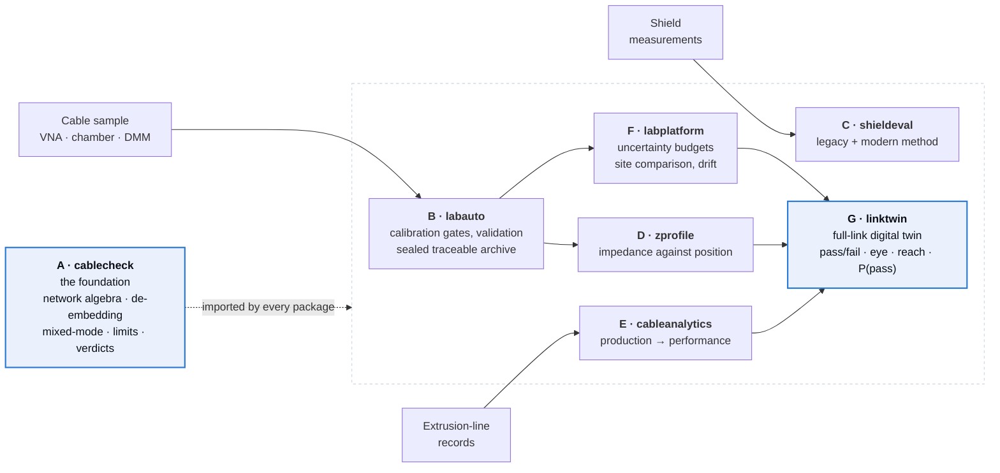

<div align="center">

# HF Cable Toolchain

**From a raw measurement to a link that has not been built yet.**

Seven engineering packages that take a high-frequency automotive Ethernet cable all the way through:
measure it, prove the measurement can be trusted, understand what the factory did to it, compare
laboratories across three countries, and predict whether a harness will pass the standard months
before the first sample exists.

[**anilram30.github.io**](https://anilram30.github.io/hf-cable/) &nbsp;·&nbsp;
[Architecture](ARCHITECTURE.md) &nbsp;·&nbsp;
[Results](RESULTS.md) &nbsp;·&nbsp;
[Roadmap](ROADMAP.md) &nbsp;·&nbsp;
[Reports](reports/)

[](https://github.com/anilram30/hf-cable-toolchain/actions/workflows/integration.yml)
[](LICENSE)
[](#the-seven-packages)
[](#the-seven-packages)
[](reports/)

</div>

---

## In one paragraph

A cable is measured on a vector network analyser and the instrument returns a file of raw scattering
parameters. Getting from that file to *"this harness will work in the car"* takes a surprising amount
of machinery: the test fixture has to be removed, the raw data converted into the quantities the
standards actually specify, the measurement itself has to be shown to be trustworthy, several
laboratories have to be shown to agree with each other within their stated uncertainties, the cable's
behaviour has to be connected back to what the extrusion line did, and finally all of it has to be
composed into a prediction about a harness that does not exist yet. This is that machinery, built as
seven independent packages that each stand alone and together form one pipeline.

## The seven packages

| | Package | What it does | Tests | Report |
|---|---|---|---|---|
| **A** | [cablecheck](https://github.com/anilram30/cablecheck) | Turns a measurement into a standards-based verdict and a report | 40 | [13 pp](reports/cablecheck.pdf) |
| **B** | [labauto](https://github.com/anilram30/labauto) | Runs the laboratory as a programmable, traceable, self-validating system | 25 | [12 pp](reports/labauto.pdf) |
| **C** | [shieldeval](https://github.com/anilram30/shieldeval) | Reconstructs a legacy-style shielding tool bit-for-bit, then modernises it | 13 | [10 pp](reports/shieldeval.pdf) |
| **D** | [zprofile](https://github.com/anilram30/zprofile) | Reconstructs impedance along the cable's length from frequency data | 14 | [17 pp](reports/zprofile.pdf) |
| **E** | [cableanalytics](https://github.com/anilram30/cableanalytics) | Connects production-line records to measured performance, and predicts it | 14 | [8 pp](reports/cableanalytics.pdf) |
| **F** | [labplatform](https://github.com/anilram30/labplatform) | Compares laboratories, quantifies uncertainty, detects drift | 16 | [11 pp](reports/labplatform.pdf) |
| **G** | [linktwin](https://github.com/anilram30/linktwin) | Predicts whether a whole harness passes, and what the receiver sees | 21 | [19 pp](reports/linktwin.pdf) |

## Architecture

Every package is installable on its own; each consumes what the earlier ones produce. These arrows
are real Python dependencies, not a diagram drawn afterwards.



[ARCHITECTURE.md](ARCHITECTURE.md) has the data flow in detail.

## Install the whole stack

Python 3.11 or newer.

```sh
pip install \
  "git+https://github.com/anilram30/cablecheck.git" \
  "git+https://github.com/anilram30/zprofile.git" \
  "git+https://github.com/anilram30/shieldeval.git" \
  "git+https://github.com/anilram30/cableanalytics.git" \
  "git+https://github.com/anilram30/labauto.git" \
  "git+https://github.com/anilram30/labplatform.git" \
  "git+https://github.com/anilram30/linktwin.git"
```

Or clone and run everything end to end:

```sh
git clone https://github.com/anilram30/hf-cable-toolchain.git
cd hf-cable-toolchain
./scripts/install-all.sh          # clone and install all seven in dependency order
./scripts/run-all-demos.sh out    # run every demonstration, write figures and reports
```

## Try it in five minutes

Every package exposes the same `demo` entry point, so the whole toolchain behaves consistently.

```sh
# A: evaluate a measured cable against the 1000BASE-T1 link segment
cablecheck demo demo_a

# D: find where along a cable the impedance goes wrong
zprofile demo demo_d

# G: will this harness pass at 85 °C, and what does the receiver see?
linktwin demo demo_g --quick
```

## Validation

Every package is checked against something independent — a closed-form result, a reciprocal
transform, a synthetic case with known ground truth, or a published reference value. The headline:
`linktwin`, given a single noisy 10 m measurement, predicts insertion loss from 3 to 25 m and 23 to
125 °C to within **0.1 dB**, extrapolates an octave beyond the measured band to within **0.04 dB**,
and its worst-case eye is a tight lower bound on a bit-level simulation — **420 against 421 mV**.

[RESULTS.md](RESULTS.md) has the full table, per package.

## A note on the data

**Everything here is synthetic.** No proprietary or customer measurements appear anywhere in this
toolchain. Cables come from a physics-based synthesiser, instruments from a simulator with a
realistic error model, and production records from a generator.

That is a deliberate choice rather than a limitation. With a synthesiser as the ground truth, the
right answer is known exactly, so every claim about accuracy is checked against a number instead of
asserted — which is how the validation results above can be stated at all. The same code reads real
Touchstone files, real archives and real production records.

## About

Built by **Sreeram Anil**, an MSc Electromobility student at FAU Erlangen-Nürnberg, as an engineering
portfolio — and built the way it would have to be built in industry: tests on three Python versions
in CI, technical reports built from source, uncertainty stated where it is warranted, and a declared
list of limitations in every report.

Built with AI assistance; the commit history records it openly. The architecture, the validation
strategy, the decisions about what each method may and may not claim, and the limitations stated in
every report are the engineering content.

MIT licensed. [sreeramanil30@gmail.com](mailto:sreeramanil30@gmail.com)
